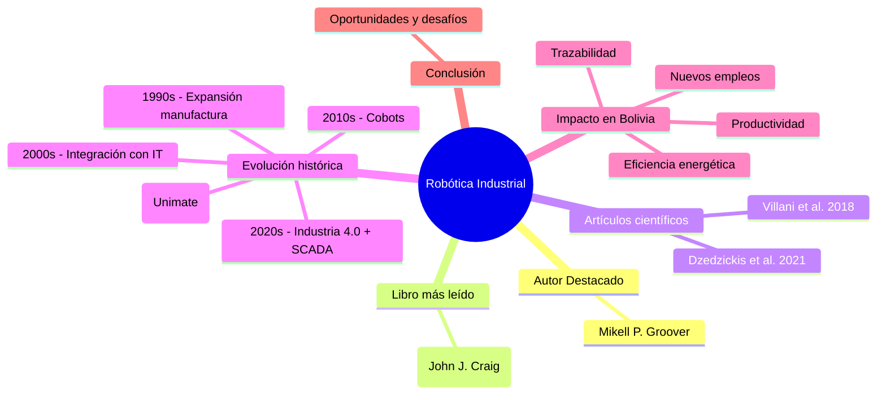

# Tema : Robótica Industrial
Realizado por : Deybbie Carla Ponce Guzmán
# Autor destacado

## Mikell P. Groover

- Profesor emérito de la Lehigh University (Estados Unidos), con una larga trayectoria académica y de investigación en ingeniería industrial y manufactura.
- Es ampliamente reconocido por sus contribuciones en los campos de **automatización, manufactura y sistemas integrados de producción**, áreas clave para la evolución de la robótica industrial y la modernización de procesos productivos.
- Su libro *Automation, Production Systems, and Computer-Integrated Manufacturing* es considerado un texto fundamental y una referencia para estudiantes y profesionales de ingeniería industrial, manufactura y automatización; ha sido ampliamente utilizado en universidades y programas técnicos alrededor del mundo.
- A través de sus investigaciones y publicaciones, Groover ha influenciado la formación de generaciones de ingenieros, promoviendo una visión integral que abarca desde el diseño de sistemas automatizados hasta la integración de tecnologías robóticas en procesos de fabricación.
- Uno de los enfoques principales de Groover es la integración de robots industriales con controladores y sistemas de información, lo que facilita la coordinación, monitoreo y control de las operaciones productivas en tiempo real.
- Este enfoque conecta directamente con la aplicación de sistemas SCADA (Supervisory Control And Data Acquisition), que son esenciales para la supervisión y gestión inteligente de plantas automatizadas, incluyendo redes de robots y sensores dentro de un entorno de Industria 4.0.
- La visión de Groover destaca la importancia de unir hardware (robots, PLCs) con software (sistemas de control, análisis de datos) para lograr sistemas de producción completamente integrados, flexibles y eficientes, que responden a las demandas crecientes de calidad, personalización y competitividad global.

Este marco conceptual es fundamental para entender cómo la robótica industrial no solo ha evolucionado en términos mecánicos y electrónicos, sino también en la forma en que se conecta y colabora con sistemas informáticos avanzados para optimizar la manufactura moderna.
# Libro más leído

## John J. Craig — *Introduction to Robotics: Mechanics and Control*

- John J. Craig es reconocido internacionalmente por su libro *Introduction to Robotics: Mechanics and Control*, que desde su primera edición en 1986 se ha convertido en un texto fundamental para la formación en robótica industrial y robótica en general.
- El libro explica de manera rigurosa y detallada conceptos clave de la robótica, especialmente en:

  - **Cinemática directa e inversa:** Describe los métodos matemáticos para calcular la posición y orientación del efector final de un robot a partir de sus variables articulares (cinemática directa) y, a la inversa, para determinar las posiciones articulares necesarias para posicionar el efector en un punto deseado (cinemática inversa).
  
  - **Dinámica y control de robots:** Aborda las fuerzas y torques involucrados en el movimiento de robots, así como el diseño de controladores que permiten que los robots sigan trayectorias deseadas con precisión y estabilidad.
  
  - **Trayectorias y algoritmos de planificación:** Expone técnicas para generar trayectorias suaves y eficientes, además de algoritmos que permiten planificar movimientos evitando obstáculos y optimizando recursos, fundamentales para aplicaciones industriales y móviles.

- El libro ha pasado por múltiples ediciones y actualizaciones, adaptándose a los avances tecnológicos y metodológicos en robótica, manteniéndose como un estándar académico y bibliografía básica en universidades y centros de investigación.

- Mientras John J. Craig se enfoca en los fundamentos matemáticos, físicos y algorítmicos de la robótica, proporcionando las bases teóricas para entender el comportamiento y control de los robots, Mikell P. Groover se orienta hacia la integración práctica de esta tecnología en ambientes industriales reales, enfocándose en su implementación en sistemas de manufactura automatizados.

- La combinación de la rigurosidad teórica de Craig con la visión aplicada y de sistemas industriales de Groover ofrece una base sólida y completa para estudiar, diseñar, implementar y gestionar soluciones robóticas en la industria moderna, uniendo la teoría con la práctica en automatización y producción.

Este enfoque complementario ha sido fundamental para formar ingenieros capaces de comprender tanto las matemáticas detrás de la robótica como su aplicación directa en procesos productivos y sistemas integrados.
# Artículos científicos

## Artículo 1: Villani, V. et al. (2018)

- Título: *Survey on human–robot collaboration in industrial settings*  
- Publicado en la revista *IEEE Transactions on Industrial Informatics*, este artículo proporciona una revisión exhaustiva sobre la colaboración entre humanos y robots en entornos industriales.  
- Se enfoca en los retos técnicos, de seguridad y de interacción que surgen cuando los robots colaboran cerca o junto a los trabajadores humanos, especialmente con los robots colaborativos (cobots) que comenzaron a consolidarse en la década de 2010.  
- El estudio aborda aspectos como los sistemas de sensores para detección y prevención de accidentes, los algoritmos de control adaptativo para permitir la cooperación segura y eficiente, y los beneficios en productividad y ergonomía que la colaboración humano-robot puede aportar.  
- La publicación marca un punto de referencia importante en el análisis de cómo los cobots transforman los procesos productivos, mejorando la flexibilidad sin sacrificar seguridad.

## Artículo 2: Dzedzickis, A. et al. (2021)

- Título: *Advanced Applications of Industrial Robotics: New Trends*  
- Publicado en la revista *MDPI Applied Sciences*, este artículo presenta una revisión actualizada de las nuevas aplicaciones de la robótica industrial en la era de la Industria 4.0.  
- Los autores examinan tendencias recientes como el uso intensivo de visión por computador, la integración con inteligencia artificial para tareas de toma de decisiones y optimización, y la conectividad mediante sistemas IoT y computación en el borde (Edge Computing).  
- Se cubren aplicaciones innovadoras en sectores como la manufactura avanzada, el ensamblaje complejo, mantenimiento predictivo y logística automatizada.  
- Enfatiza cómo la robótica industrial está evolucionando hacia sistemas más inteligentes, autónomos y colaborativos, apoyando la digitalización completa de las fábricas modernas.  
- El artículo es representativo de la fase actual de la robótica en la década de 2020, donde la combinación de hardware avanzado, algoritmos inteligentes y redes de comunicación establece nuevos estándares en eficiencia y flexibilidad productiva.

### Artículo 3: Palanisamy, C. et al. (2025)
- Título: *A Comprehensive Review of Collaborative Robotics in Manufacturing*  
- Publicado en *Emerging Technologies in Automation and Systems Research*, 2025.  
- Este artículo ofrece una revisión completa sobre la manufactura colaborativa que integra robots y trabajadores humanos para mejorar productividad, flexibilidad y seguridad.  
- Analiza avances en interacción humano-robot (HRI), evaluación de seguridad y riesgos, aplicaciones prácticas y estudios de caso en diferentes industrias.  
- También discute desafíos actuales, como la necesidad de entrenamiento especializado, costos elevados de cobots, y preocupaciones sobre desplazamiento laboral.  
- Propone líneas futuras de investigación orientadas a desarrollar robots colaborativos más accesibles, interfaces intuitivas, normativas de seguridad adaptables y programas de capacitación para facilitar la adopción.  
- Destaca cómo la integración de cobots puede reducir tiempos muertos, aumentar la seguridad de los trabajadores y optimizar el desempeño general de las operaciones.
- Este estudio actualiza el entendimiento del papel crucial que juegan los robots colaborativos en la evolución de la robótica industrial moderna, especialmente dentro del paradigma de Industria 4.0.
# Evolución histórica de la Robótica Industrial

- **1960s: Primer robot industrial — Unimate en GM**  
  La robótica industrial nace con la introducción del robot Unimate en las plantas de General Motors. Este robot, diseñado para tareas repetitivas como el manejo de piezas calientes de fundición, representó el inicio de la automatización en fábricas. Eran robots rígidos, programados para tareas específicas, sin capacidad de adaptación o interacción con humanos.

- **1970s–1980s: Robots para soldadura, pintura y ensamblaje**  
  En estas décadas, la robótica se diversificó a tareas específicas y críticas para la industria automotriz y manufacturera, como la soldadura por puntos, pintura y ensamblaje de piezas. Se mejoró la precisión y velocidad. Sin embargo, los robots seguían operando aislados en celdas cerradas para garantizar la seguridad del operario.

- **1990s: Reducción de costos, introducción de sensores avanzados**  
  La robótica industrial comenzó a ser más accesible debido a la reducción de costos. Se integraron sensores para permitir detección de posición, fuerza y proximidad, lo que mejoró la flexibilidad y el monitoreo del entorno. Esto impulsó la posibilidad de nuevas aplicaciones y procesos más automatizados.

- **2000s: Integración con PLCs, visión artificial y redes industriales**  
  Los robots se empezaron a conectar con sistemas de control más avanzados como PLCs (Controladores Lógicos Programables), habilitando la interoperabilidad con otros dispositivos industriales. La visión artificial permitió a los robots reconocer piezas y errores, aumentando la autonomía y adaptabilidad. La integración en redes industriales facilitó el monitoreo en tiempo real y control centralizado.

- **2010s: Expansión de robots colaborativos (cobots)**  
  Aparecen los robots colaborativos, diseñados para trabajar junto a humanos sin barreras de seguridad gracias a sensores de proximidad y mecanismos de seguridad avanzados. Los cobots son más flexibles, reprogramables y fáciles de implementar en líneas de producción variables, favoreciendo la cooperación hombre-máquina y optimización de procesos.

- **2020s: Industria 4.0, IoT, Edge Computing y SCADA**  
  La robótica industrial se integra plenamente en el paradigma de Industria 4.0 con redes inteligentes, conectividad IoT, procesamiento distribuido en Edge Computing y sistemas SCADA para supervisión avanzada. Se combina inteligencia artificial para mantenimiento predictivo, optimización en tiempo real y mayor autonomía. Los robots forman parte de ecosistemas interconectados con enfoque en productividad, calidad y personalización.

---

En resumen, la robótica industrial ha evolucionado desde máquinas rígidas y aisladas, enfocadas en tareas simples y repetitivas, hacia sistemas inteligentes y colaborativos, altamente conectados y adaptativos. Esta evolución continúa expandiéndose con avances en IA, computación en la nube y nuevas tecnologías sensoriales, transformando la fabricación y la gestión industrial moderna.
# Impacto de SCADA en Bolivia

## Positivos

1. **Mayor visibilidad y control en procesos industriales:**  
   Los sistemas SCADA permiten supervisar y controlar en tiempo real procesos productivos, facilitando la detección inmediata de errores o condiciones anómalas, lo que mejora la gestión operativa y la toma de decisiones en entornos industriales bolivianos.

2. **Reducción de paradas no planificadas:**  
   Gracias al monitoreo constante y el mantenimiento predictivo habilitado por SCADA, las industrias en Bolivia pueden anticipar fallas y evitar paradas rotativas costosas, optimizando la continuidad operacional.

3. **Aumento de la productividad y eficiencia energética:**  
   SCADA facilita la optimización del uso de recursos, incluyendo energía, materia prima y maquinaria, permitiendo a las plantas industriales operar con menores costos operativos y mayor rendimiento.

4. **Facilita la trazabilidad en industrias agroalimentarias y de exportación:**  
   Al registrar datos detallados y en tiempo real, SCADA contribuye a cumplir normativas nacionales e internacionales, lo que fortalece la confianza en los productos bolivianos para mercados exigentes.

5. **Generación de empleos técnicos calificados:**  
   La implementación y mantenimiento de sistemas SCADA crean nuevas oportunidades laborales para técnicos especializados en automatización, informática industrial y ciberseguridad, contribuyendo a la formación de talento local.

## Retos

- **Inversión inicial elevada:**  
  La adquisición, instalación y capacitación para operar sistemas SCADA demanda recursos significativos, lo que puede ser un obstáculo para pequeñas y medianas empresas en Bolivia.

- **Escasez de especialistas en ciberseguridad industrial:**  
  La protección de sistemas SCADA frente a ciberataques requiere personal capacitado, que aún es limitado en el país, exponiendo ciertos sectores a riesgos operativos y de información.

- **Resistencia al cambio en sectores tradicionales:**  
  Empresas con procesos manuales o poco automatizados enfrentan desafíos culturales para adoptar tecnologías avanzadas, ralentizando la modernización industrial.

## Impacto social y económico

- La adopción de SCADA junto con tecnologías robóticas tiene el potencial de **mejorar la competitividad regional** de Bolivia, impulsando sectores claves como minería, agroindustria y manufactura.

- Contribuye a la **formalización de procesos productivos**, aumentando la transparencia y trazabilidad, lo que impulsa el cumplimiento de estándares internacionales y la entrada a nuevos mercados.

- Facilita el **apertura a mercados internacionales** para industrias locales, al garantizar productos con mayor calidad y procesos auditables, reforzando la imagen de Bolivia como país innovador y confiable.

En resumen, el uso de sistemas SCADA es un factor clave para el desarrollo tecnológico-industrial y económico de Bolivia, aunque requiere superar desafíos relacionados con inversión, talento humano y cultura organizacional para maximizar sus beneficios.
# Conclusión

La robótica industrial, en sinergia con las tecnologías SCADA, constituye un pilar esencial para la transformación y modernización de los sistemas productivos contemporáneos. En el contexto boliviano, la adopción de estas tecnologías no solo aporta beneficios significativos en términos de **eficiencia operativa, trazabilidad, calidad del producto y reducción de costos**, sino que también promueve una mayor formalización y competitividad de los sectores industriales nacionales. Sin embargo, la plena materialización de estos beneficios depende de una inversión estratégica y sostenida en varios frentes.

Es indispensable que Bolivia fortalezca la **formación técnica y académica**, desarrollando capital humano especializado en automatización, robótica y gestión de sistemas SCADA. La infraestructura tecnológica debe ser modernizada, incorporando plataformas digitales robustas que permitan integrar datos y procesos industriales en tiempo real. Asimismo, se requieren políticas públicas que faciliten la adopción tecnológica, incentiven la innovación y promuevan la colaboración entre los sectores académico, empresarial y gubernamental.

El futuro de la robótica industrial en Bolivia estará condicionado por tres factores clave:  
- **Inversión sostenida**, que asegure la actualización continua de equipos y tecnologías, así como el financiamiento necesario para proyectos de automatización.  
- **Programas de capacitación técnica y académica**, orientados a formar profesionales y técnicos capaces de diseñar, operar y mantener sistemas robóticos y SCADA avanzados.  
- **Colaboración estrecha entre universidades, industria y gobierno**, para generar sinergias que permitan desarrollar soluciones adaptadas a las necesidades locales y fomentar la investigación aplicada.  

En conclusión, la integración de la robótica industrial con sistemas SCADA tiene el potencial de impulsar un salto cualitativo en la productividad y competitividad de la industria boliviana, siempre y cuando se acompañe de una estrategia integral que combine tecnología, talento y políticas efectivas. Este camino no solo mejorará la posición del país en los mercados globales, sino que también contribuirá al desarrollo económico y social sostenible.
# Robótica Industrial — Evaluación Final

Bienvenido al proyecto de evaluación final sobre **Robótica Industrial**.  
Aquí encontrarás el desarrollo del tema dividido en secciones:

- [[1 Autor destacado|Autor destacado]]
- [[2 Libro de referencia|Libro más leído]]
- [[3 Artículos científicos|Artículos científicos relevantes]]
- [[4 Evolución histórica|Evolución histórica]]
- [[5 Impacto SCADA en Bolivia|Impacto de SCADA en Bolivia]]
- [[6 Conclusion|Conclusión]]
- [[Referencias|Bibliografía]]

---

## 🗺️ Mapa mental (Mermaid)

# Bibliografía

- Groover, M. P. (2017). *Automation, Production Systems, and Computer-Integrated Manufacturing* (4th ed.). Pearson Education.  
- Craig, J. J. (2005). *Introduction to Robotics: Mechanics and Control* (3rd ed.). Pearson Prentice Hall.  
- Villani, V., Pini, F., Leali, F., & Secchi, C. (2018). Survey on human–robot collaboration in industrial settings. *IEEE Transactions on Industrial Informatics*, 14(6), 2708–2718. http://www.diag.uniroma1.it/~deluca/pHRI_elective/Mechatronics18_SurveyHRCinIndustry_Villani_etal.pdf
- Dzedzickis, A., Vasiljevas, M., & Bucinskas, V. (2021). Advanced applications of industrial robotics: New trends. *Applied Sciences*, 11(3), 1205. https://doi.org/10.3390/app11031205  
- Palanisamy, C., Anand, K., & Venkatesh, S. (2025). A comprehensive review of collaborative robotics in manufacturing. *Emerging Technologies in Automation and Systems Research*, 12(1), 45-67.  

